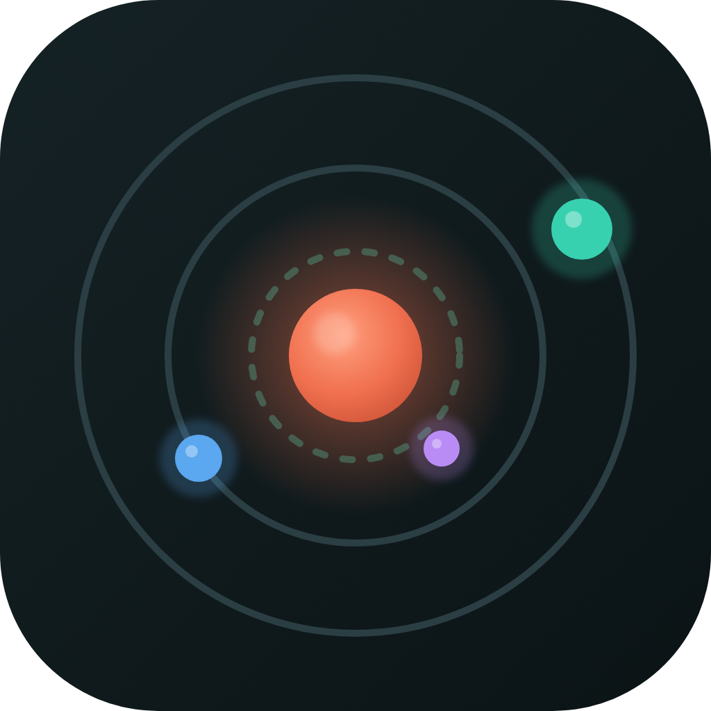
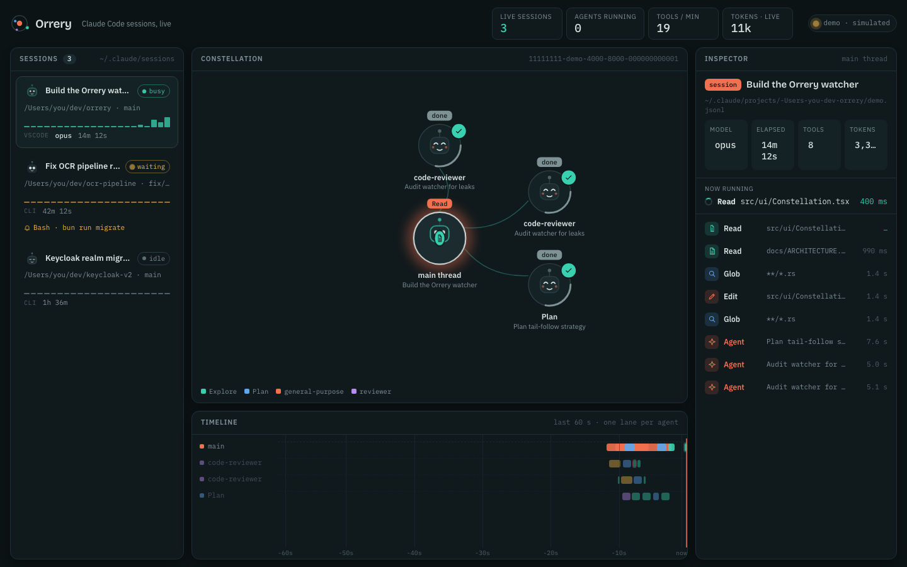

<p align="center">
  
</p>

<h1 align="center">Orrery</h1>

<p align="center">
  A live orrery for your <a href="https://code.claude.com">Claude Code</a> sessions.<br>
  See every session, every spawned agent and every tool call as it happens — without touching Claude Code.
</p>

<p align="center">
  <a href="LICENSE"></a>
  
  
  
</p>

---

Claude Code is a terminal. When it spawns three subagents you get three collapsed lines. Orrery turns the files Claude Code already writes into a moving picture: which sessions are alive, which agent is reading, grepping or editing what, how long each tool call took, and where the tokens go.

<p align="center">
  
</p>

## Why it is safe to run next to Claude Code

Orrery is **read-only and passive**:

- It watches `~/.claude` with filesystem notifications and reads only the bytes appended since the last read.
- No hooks, no environment variables, no OTEL exporters, no sockets. Claude Code cannot tell Orrery exists.
- Nothing is ever written under `~/.claude`.
- If Orrery crashes, nothing happens to your sessions.

Details in [docs/ZERO_IMPACT.md](docs/ZERO_IMPACT.md).

## Works with

| Frontend                         | Supported | Notes                                                             |
| -------------------------------- | --------- | ----------------------------------------------------------------- |
| `claude` in a terminal           | ✅        |                                                                   |
| Claude Code VS Code / JetBrains  | ✅        | Same files under `~/.claude`                                      |
| Claude Desktop / Cowork sessions | ✅        | Same files                                                        |
| `claude --bg` / `claude agents`  | ✅        | Registry via `~/.claude/jobs` (planned in v0.2, see project plan) |
| Agent SDK apps on this machine   | ✅        | When they use the default storage location                        |
| claude.ai/code cloud sessions    | ❌        | They run in the cloud; no local transcript                        |
| Another machine's sessions       | ❌ (yet)  | A remote engine is on the roadmap                                 |

## Install

Prebuilt binaries will be attached to [GitHub releases](../../releases) once v0.1.0 ships. Until then, build from source (below).

## Build from source

Requirements: Node 20+, pnpm 9+, Rust 1.80+, and the [Tauri 2 prerequisites](https://v2.tauri.app/start/prerequisites/) for your OS.

```sh
git clone https://github.com//claude-code-orrery
cd orrery
pnpm install
pnpm app:dev      # desktop app with hot reload
pnpm app:build    # release bundle in src-tauri/target/release/bundle
```

### Browser-only development

```sh
pnpm dev
```

Without the desktop shell the UI runs in **demo mode** with simulated sessions, so the whole interface can be worked on without Claude Code running. The badge in the top-right says `demo · simulated`.

### Headless: print every event as JSON

```sh
cargo run -p orrery-core --example tail
```

Useful for debugging or for building your own consumer on top of the engine.

## How it works

```
Claude Code ──writes──▶ ~/.claude/sessions/<pid>.json           who is alive, busy / idle / waiting
                        ~/.claude/projects/<proj>/<sid>.jsonl   prompts, tool calls, results, usage
                        …/<sid>/subagents/agent-<id>.jsonl      each subagent's own transcript
                                  │
                                  │ FSEvents / inotify (read-only)
                                  ▼
                 orrery-core (Rust) — tail new bytes → parse lines → normalized events
                                  │
                                  │ Tauri event channel
                                  ▼
                 React UI — reducer → sessions / agents / tool calls → constellation, timeline, inspector
```

- [docs/ARCHITECTURE.md](docs/ARCHITECTURE.md) — modules and data flow
- [docs/DATA_SOURCES.md](docs/DATA_SOURCES.md) — the exact files and record shapes Orrery understands
- [docs/DESIGN.md](docs/DESIGN.md) — brand, color, type, motion
- [docs/PROJECT_PLAN.md](docs/PROJECT_PLAN.md) — what exists, what's next, what's possible

## Project layout

```
crates/orrery-core/   Rust engine: paths, tailer, parser, registry, history, engine (+ tests)
src-tauri/            Tauri 2 shell: commands, event forwarding, bundling config, icons
src/                  React + TypeScript UI (Vite)
  lib/                wire types, pure reducer (+ tests), demo simulator, bridge
  components/         TopBar, SessionRail, Constellation, Timeline, Inspector, Bot, Icons
  styles/             design tokens and app stylesheet
design/               brand assets and the original animated HTML mock (`orrery-mock.html`)
docs/                 architecture, data sources, design, project plan, zero-impact policy
.claude/              project-scoped Claude Code skills and plugin config for contributors
```

## Contributing

See [CONTRIBUTING.md](CONTRIBUTING.md). The short version: `pnpm lint && pnpm test && cargo test --workspace` must pass, and anything that touches how files under `~/.claude` are read must keep the [zero-impact policy](docs/ZERO_IMPACT.md).

Contributors using Claude Code get the project's skills automatically — see [`.claude/README.md`](.claude/README.md).

## License

[MIT](LICENSE) © Orrery contributors
